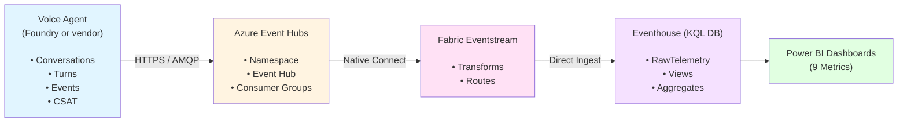

<div align="center">
  
  
  # TalkSense
  
  **Compreensão inteligente das chamadas**
  
  > Real-time voice agent analytics platform for the financial sector  
  > Open-source reference implementation using Azure Event Hubs, Microsoft Fabric, and Power BI
  
  [](LICENSE)
  [](https://azure.microsoft.com)
  [](https://powerbi.microsoft.com)
</div>

---

## Overview

**TalkSense** is a pilot-ready analytics platform for monitoring AI voice agents in financial services. It provides real-time insights into conversation quality, customer satisfaction, AI performance, and operational metrics.

### Key Features

- **9 Core Metrics** — Retention, latency, overflow, errors, CSAT
- **Real-time Analytics** — Sub-minute latency from event to dashboard
- **Modern Architecture** — Event Hub → Fabric Eventstream → Eventhouse → Power BI
- **LGPD/GDPR Compliant** — PII anonymization and data masking
- **Power BI Dashboards** — Overview, drill-through, error analysis
- **IaC Ready** — Bicep and Terraform templates included
- **Synthetic Data Generator** — Mock environment for testing

---

## Architecture



**See**: [Architecture Diagrams](infra/docs/architecture-diagram.md)

---

## The 9 Core Metrics

| # | Metric | Description | Target |
|---|--------|-------------|--------|
| 1 | **AI Retention** | % of conversations resolved by AI | ≥ 80% |
| 2 | **TMR (Mean Response Time)** | Average latency per turn | < 3s |
| 3 | **TMA (Max Response Time)** | Maximum latency in conversation | < 5s |
| 4 | **Top Intents** | Most triggered intents/services | Top 10 |
| 5 | **Overflow (No Comprehension)** | % non-understanding events | < 5% |
| 6 | **Return to IVR** | % returns to IVR menu | < 8% |
| 7 | **Agent Requested** | % human agent requests | < 15% |
| 8 | **System Errors** | % technical errors | < 2% |
| 9 | **CSAT Average** | Customer satisfaction score | ≥ 4.0/5.0 |

---

## Quick Start

### Prerequisites

- Azure subscription with Event Hubs
- Microsoft Fabric capacity (F2+ for POC)
- Power BI Pro or Premium
- Azure CLI + Bicep/Terraform
- Python 3.8+ (for data generator)

### 1. Deploy Infrastructure

Choose **Bicep** or **Terraform**:

#### Option A: Automated (Recommended)
```powershell
cd infra/
.\deploy-planb.ps1 -Environment dev -Location eastus2
```

#### Option B: Bicep
```powershell
cd infra/bicep
.\deploy.ps1 -Environment dev
```

#### Option C: Terraform
```bash
cd infra/terraform
terraform init
terraform apply
```

### 2. Configure Fabric

Follow the guide: [`fabric-configuration.md`](infra/docs/fabric-configuration.md)

1. Create **Eventstream** connected to Event Hub
2. Create **Eventhouse** (KQL Database)
3. Run KQL scripts to create tables
4. Enable **OneLake availability**

### 3. Generate Synthetic Data (Testing)

```bash
cd docs/sample-data
python gerar_dados_sinteticos_talksense.py --conversas 1000 --dias 30
```

**Outputs**:
- `eventhub_events.json` — Event Hub format (JSON)
- `conversations.csv`, `turns.csv`, `events.csv`, `csat.csv` — Eventhouse format

### 4. Create Power BI Dashboards

Follow: [`powerbi-configuration.md`](infra/docs/powerbi-configuration.md)

1. Connect to Eventhouse via **Direct Lake**
2. Import **DAX measures** (9 metrics)
3. Create 3 dashboard pages

> ✅ A ready-to-open **PBIP project** with the semantic model (all 9 metrics as DAX measures) and a starter report is available at [`powerbi/TalkSense.pbip`](powerbi/README.md).

### 5. Simulate Event Hub for a POC (optional)

Infra deployment scripts provision Event Hub/Eventstream/Eventhouse only — they do **not** upload or stream the sample datasets. To generate a continuous, realistic event flow for a POC without a real Event Hub, use the Fabric notebook simulator: [`mock/talksense_eventhub_simulator.ipynb`](mock/README.md).

---

## Project Structure

```
talksense/
├── infra/                      # Infrastructure as Code
│   ├── bicep/                         # Azure Bicep templates
│   ├── terraform/                     # Terraform configuration
│   ├── docs/                          # Technical documentation
│   │   ├── event-hub-message-format.md   # JSON schema spec
│   │   ├── fabric-configuration.md       # Fabric setup guide
│   │   ├── powerbi-configuration.md      # Dashboard + DAX
│   │   └── architecture-diagram.md       # Mermaid diagrams
│   ├── deploy-planb.ps1               # Automated deployment
│   └── README.md                      # Infrastructure guide
├── powerbi/                    # Power BI Project (PBIP) with the 9 metrics
│   ├── TalkSense.pbip                 # Open this in Power BI Desktop
│   ├── TalkSense.Report/              # Report definition (PBIR)
│   └── TalkSense.SemanticModel/       # Semantic model (TMDL) + DAX measures
├── mock/                       # POC simulators (not for production)
│   └── talksense_eventhub_simulator.ipynb  # Fabric notebook: simulates Event Hub traffic
├── docs/
│   ├── plano-telemetria-analytics.md  # Main analytics plan
│   ├── powerbi-prompts.md             # Power BI guidance
│   ├── sample-data/                   # Synthetic data generator
│   │   ├── gerar_dados_sinteticos_talksense.py  # Python generator
│   │   └── output/                    # Generated CSVs + JSON
│   └── adr/                           # Architecture decisions
│       ├── adr-001-banco-de-dados-analytics.md
│       └── adr-002-ingestao-fabric-rti-eventhouse.md
├── .gitignore                         # Git exclusions
└── README.md                          # This file
```

---

## Event Hub Message Format

TalkSense uses 4 event types:

### 1. conversation_started
```json
{
  "eventType": "conversation_started",
  "timestamp": "2026-07-02T14:30:15.123Z",
  "conversationId": "conv-20260702-143015-abc123",
  "payload": {
    "sessionId": "sess-xyz789",
    "channel": "phone",
    "customerIdAnon": "a3d5e7f9b1c2...",
    "customerSegment": "Premium",
    "initialIntent": "saldo"
  }
}
```

### 2. turn_completed
```json
{
  "eventType": "turn_completed",
  "timestamp": "2026-07-02T14:30:18.456Z",
  "conversationId": "conv-20260702-143015-abc123",
  "payload": {
    "turnIndex": 1,
    "userUtterance": "[MASKED]",
    "agentResponse": "Seu saldo atual é R$ 12.345,67.",
    "intent": "saldo",
    "latencyMs": 1250,
    "sentiment": {"overall": "neutral", "score": 0.52}
  }
}
```

**See**: [Complete Event Spec](infra/docs/event-hub-message-format.md)

---

## Security & Compliance

### LGPD/GDPR Features

- ✅ **Customer ID Anonymization** — SHA256 hashing
- ✅ **PII Masking** — `userUtterance` masked/removed
- ✅ **Data Retention** — Configurable TTL policies
- ✅ **Row-Level Security** — Power BI RLS
- ✅ **Private Endpoints** — Production template included
- ✅ **Managed Identity** — No SAS keys in production

### Production Security Checklist

- [ ] Disable SAS authentication (Event Hub)
- [ ] Enable Private Endpoints
- [ ] Configure Managed Identity
- [ ] Apply RLS rules in Power BI
- [ ] Encrypt secrets in Key Vault
- [ ] Enable diagnostic logging
- [ ] Configure NSG rules

---

## Cost Estimation

### POC/Development
- Event Hub (Standard, 1 TU): ~**$25/month**
- Fabric Capacity (F2): ~**$260/month**
- Power BI Pro: ~**$10/user/month**
- **Total**: ~**$300/month**

### Production
- Event Hub (Premium, zone-redundant): ~**$670/month**
- Fabric Capacity (F8): ~**$1,040/month**
- Power BI Premium (P1): ~**$4,995/month**
- **Total**: ~**$6,750/month**

> Use [Azure Pricing Calculator](https://azure.microsoft.com/pricing/calculator/) for precise estimates.

---

## Documentation

| Document | Description | Size |
|----------|-------------|------|
| [Main Analytics Plan](docs/plano-telemetria-analytics.md) | Complete telemetry & analytics plan | 21 KB |
| [Infrastructure README](infra/README.md) | IaC overview & quick start | 12 KB |
| [Event Hub Schema](infra/docs/event-hub-message-format.md) | JSON message specification | 15 KB |
| [Fabric Configuration](infra/docs/fabric-configuration.md) | Eventstream & Eventhouse setup | 16 KB |
| [Power BI Guide](infra/docs/powerbi-configuration.md) | Dashboards & DAX measures | 16 KB |
| [Architecture Diagrams](infra/docs/architecture-diagram.md) | Mermaid diagrams | 12 KB |
| [Power BI Project (PBIP)](powerbi/README.md) | Semantic model + DAX measures + starter report | — |
| [Event Hub Simulator](mock/README.md) | Fabric notebook for POC event simulation | — |
| [ADR-001](docs/adr/adr-001-banco-de-dados-analytics.md) | Database choice decision | 6 KB |
| [ADR-002](docs/adr/adr-002-ingestao-fabric-rti-eventhouse.md) | Fabric RTI ingestion decision | 11 KB |

---

## Technology Stack

- **Cloud Platform**: Microsoft Azure
- **Ingestion**: Azure Event Hubs
- **Processing**: Microsoft Fabric (Eventstream)
- **Storage**: Fabric Eventhouse (KQL Database)
- **Analytics**: Microsoft Fabric Real-Time Intelligence
- **Visualization**: Power BI (Direct Lake)
- **IaC**: Azure Bicep + Terraform
- **Data Generator**: Python 3.8+

---

## Contributing

This is a reference implementation for educational purposes. Contributions welcome!

1. Fork the repository
2. Create a feature branch (`git checkout -b feature/amazing-feature`)
3. Commit your changes (`git commit -m 'Add amazing feature'`)
4. Push to the branch (`git push origin feature/amazing-feature`)
5. Open a Pull Request

---

## License

This project is licensed under the **MIT License** - see the [LICENSE](LICENSE) file for details.

---

## Acknowledgments

- Microsoft Azure team for Event Hubs and Fabric RTI
- Power BI community for best practices
- Open-source contributors

---

## Support

For issues or questions:

1. Review [documentation](infra/docs/)
2. Check [Azure Event Hubs docs](https://docs.microsoft.com/azure/event-hubs/)
3. Consult [Fabric RTI docs](https://learn.microsoft.com/fabric/real-time-intelligence/)
4. Open a GitHub issue

---

**TalkSense** — Compreensão inteligente das chamadas

Built for the financial services sector
