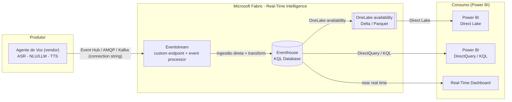
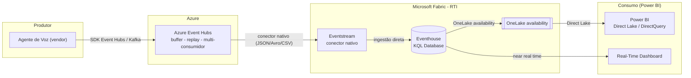
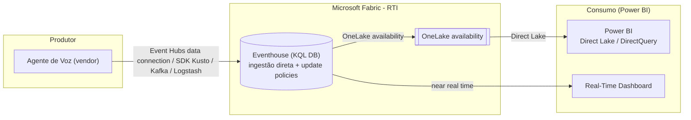

# ADR-002 — Ingestão de telemetria e store analítico: Fabric Real-Time Intelligence (Eventstream/Eventhouse) vs. Event Hubs + Cosmos DB

- **Projeto:** TalkSense (Compreensão inteligente das chamadas)
- **Status:** Accepted (Plano B implementado)
- **Data:** 2026-07-01
- **Decisores:** Arquitetura de Dados / Analytics / Segurança
- **Relacionado:** [`plano-telemetria-analytics.md`](../plano-telemetria-analytics.md) · [ADR-001](./adr-001-banco-de-dados-analytics.md)

## Contexto

O [plano de telemetria](../plano-telemetria-analytics.md) (§3) propõe a esteira:

> Agente de voz → **Azure Event Hubs** → função/stream processor → **Cosmos DB** → *Fabric Mirroring*
> (ou *Synapse Link*) → **Power BI** (Direct Lake).

A [ADR-001](./adr-001-banco-de-dados-analytics.md) decidiu o **store transacional** (Cosmos DB for NoSQL).
Esta ADR-002 revisita a **camada de ingestão + o store que serve o analytics**, avaliando a
**viabilidade** de trocar o Azure Event Hubs / Cosmos DB por **Microsoft Fabric Real-Time Intelligence
(RTI)** — em particular **Eventstream** (ingestão/roteamento) e **Eventhouse / KQL Database**
(armazenamento e consulta analítica).

As perguntas concretas a responder são:

1. É **factível** o agente de voz **enviar a telemetria diretamente para o Eventhouse** (ou para o
   Cosmos DB) de forma **automática**, sem uma camada de função customizada?
2. É **factível** o padrão **Azure Event Hubs → Fabric Eventstream → Eventhouse**?
3. Qual arranjo entrega o melhor *time-to-dashboard* no Power BI, mantendo conformidade LGPD/GDPR?
4. Como tornar a arquitetura **replicável** para outras instituições financeiras (open-source ready)?

### Aderência da carga ao RTI

A telemetria do agente é **orientada a eventos, semiestruturada e com texto livre** (turnos, transcrição
aninhada, sentimento por turno, eventos de erro/barge-in). O **Eventhouse** é descrito pela Microsoft como
_"o motor preferencial para análise semiestruturada e de texto livre"_, capaz de consultar bilhões de
eventos em segundos e ingerir de múltiplas fontes (Eventstream, SDKs, Kafka, Logstash, dataflows). Ou seja,
o perfil da carga é **naturalmente aderente** ao RTI — o que motiva esta avaliação.

## Critérios de decisão

1. **Ingestão automática pelo agente** (o vendor consegue *pushar* eventos sem código customizado?).
2. **Analytics near real-time no Power BI** (latência fim-a-fim até o dashboard).
3. **Menor número de peças móveis / *time-to-dashboard*** na POC.
4. **Aderência a JSON aninhado + texto livre** (transcrição, sentimento).
5. **Point read / drill-through** de 1 conversa (requisito central do dashboard).
6. **Custo** na escala de POC.
7. **Segurança/LGPD** (mascaramento, RLS, retenção/expurgo de PII, rede privada).
8. **Aderência ao ecossistema do consumidor** (Power BI/Fabric) **e do produtor** (vendor, possivelmente AWS).

## Diagramas de arquitetura

Diagramas editáveis em **draw.io** (abrir com a extensão *Draw.io Integration* no VS Code ou em <https://app.diagrams.net>). As versões Mermaid abaixo renderizam direto no GitHub/VS Code.

| Opção | Arquivo editável (.drawio) |
|---|---|
| A | [`diagrams/adr-002-opcao-a-eventstream-eventhouse.drawio`](../diagrams/adr-002-opcao-a-eventstream-eventhouse.drawio) |
| B | [`diagrams/adr-002-opcao-b-eventhubs-eventstream-eventhouse.drawio`](../diagrams/adr-002-opcao-b-eventhubs-eventstream-eventhouse.drawio) |
| C | [`diagrams/adr-002-opcao-c-eventhouse-direto.drawio`](../diagrams/adr-002-opcao-c-eventhouse-direto.drawio) |

### Opção A — Agente → Eventstream (custom endpoint) → Eventhouse → Power BI



> Elimina o Azure Event Hubs e a Azure Function. Latência do Direct Lake por *batching* (até 3 h; mín. 5 min) → usar DirectQuery/KQL ou Real-Time Dashboard para visuais ao vivo.

### Opção B — Agente → Azure Event Hubs → Eventstream → Eventhouse → Power BI



> Event Hubs desacopla o produtor do Fabric (buffer/replay/multi-consumidor). Atenção: ingestão de Event Hub via **Private Link não é suportada** para o Eventstream/KQL DB.

### Opção C — Agente → Eventhouse direto (sem Eventstream)



> Caminho mais curto, porém **sem** a camada de transformação/roteamento do Eventstream (recai em *update policies* KQL) e **sem Private Link** na conexão Event Hubs → KQL DB.

## Opções avaliadas

### Opção A — Agente → **Eventstream (custom endpoint)** → **Eventhouse** → Power BI ✅ (recomendada p/ POC)

O Eventstream expõe uma fonte **Custom App / Custom endpoint** que fornece *connection string* + *sample
code* nos protocolos **Event Hub, AMQP e Kafka**. O agente de voz *pusha* os eventos direto para esse
endpoint (compatível com o SDK `@azure/event-hubs`), o Eventstream faz *event processing* e roteia com
**ingestão direta** para o Eventhouse. O Power BI consome via **OneLake availability → Direct Lake** e/ou
**DirectQuery/consulta KQL** e **Real-Time Dashboards**.

```
┌──────────────────┐  Event Hub/AMQP/Kafka   ┌──────────────────┐  ingestão direta  ┌───────────────┐
│  Agente de Voz   │ ──────────────────────► │ Fabric Eventstream│ ────────────────► │  Eventhouse   │
│  (vendor)        │  (connection string do  │ (custom endpoint  │  (+ transform/    │  (KQL DB)     │
│                  │   custom endpoint)      │  + event processor)│   roteamento)    │               │
└──────────────────┘                         └──────────────────┘                   └───────┬───────┘
                                                                                             │ OneLake
                                                                        ┌────────────────────┴─────────────┐
                                                                        ▼                                   ▼
                                                              Direct Lake (Power BI)          DirectQuery/KQL + Real-Time Dashboard
```

**Prós**
- **Ingestão automática sem código de infra próprio:** o agente usa a *connection string* do custom
  endpoint (Event Hub/Kafka/AMQP) — **elimina** o Azure Event Hubs **e** a Azure Function do plano original.
- **Menos peças móveis** → menor *time-to-dashboard* na POC (Eventstream + Eventhouse dentro do Fabric).
- **Eventhouse é ideal para JSON aninhado + texto livre** (transcrição, sentimento por turno) e faz
  agregações sobre bilhões de eventos em segundos (base direta das métricas #2/#4/#8 e da linha do tempo).
- **Near real-time real:** *Real-Time Dashboards* nativos e Power BI em **DirectQuery/KQL** dão frescor de
  segundos; *Direct Lake* atende o restante do modelo semântico.
- *Point read*/drill-through por `conversationId` atendido por KQL (lookup rápido) — dispensa Cosmos para o
  dashboard.

**Contras / atenções**
- Exige **capacidade Fabric (SKU F)** ativa; custo é por CU e não por evento.
- **OneLake availability** faz *batching* adaptativo: atraso de escrita **padrão até 3 h** (ou até formar
  arquivos de 200–256 MB), **configurável de 5 min a 3 h**. → Para frescor de segundos, usar **DirectQuery/KQL
  ou Real-Time Dashboard**, não o caminho Delta/Direct Lake.
- **Limite** de 11 fontes+destinos combinados quando se usa *custom endpoint* + *eventhouse* com ingestão
  direta (irrelevante para a POC).
- Restrições enquanto **OneLake availability** está ligada (ver §LGPD): sem *rename*, sem alterar tipo de
  coluna, **sem RLS na tabela KQL** e **sem delete/truncate/purge** manual.

### Opção B — Agente → **Azure Event Hubs** → **Eventstream** → **Eventhouse** → Power BI ✅ (recomendada p/ produção)

Mantém o **Azure Event Hubs** como *buffer* de ingestão desacoplado do Fabric; o Eventstream consome o Event
Hubs (conector nativo, formatos JSON/Avro/CSV) e roteia para o Eventhouse.

**Prós**
- **Desacoplamento produtor↔Fabric:** *buffer*, *replay*, *retention* e **múltiplos consumidores** no Event
  Hubs (útil se outros sistemas também consomem a telemetria).
- Endpoint de ingestão **padrão de mercado** (Event Hubs/Kafka), estável e independente do ciclo de vida do
  workspace Fabric — bom para contrato com o vendor.
- Demais benefícios analíticos idênticos à Opção A (Eventhouse + Power BI).

**Contras / atenções**
- **Mais uma peça** (Event Hubs) → mais custo e configuração que a Opção A.
- **Ingestão de Event Hub via Private Link não é suportada** no caminho para o KQL DB/Eventstream → impacta
  desenhos de rede privada (ver §LGPD).

### Opção C — Agente → **Eventhouse (data connection / SDK)** direto, **sem** Eventstream

O Eventhouse aceita ingestão direta via **conexão de dados do Event Hubs**, **SDKs Kusto**, **Kafka**,
**Logstash**, etc.

**Prós**
- Caminho **mais curto** possível para dentro do KQL DB.

**Contras**
- **Sem a camada de transformação/roteamento** do Eventstream (normalização, *fan-out* para vários destinos,
  *derived streams*). Toda transformação recai em **update policies** KQL.
- Menos flexível para evoluir (ex.: rotear bruto para um Eventhouse e filtrado para outro / Lakehouse).
- A conexão direta de Event Hubs para o KQL DB **não suporta Private Link**.

### Baseline — Event Hubs → Function → **Cosmos DB** → **Fabric Mirroring** → Power BI (plano atual / ADR-001)

**Prós**
- **Store OLTP** maduro; *point read* garantido em milissegundos por `id`/partition key (drill-through).
- Serve também **workloads operacionais** (não só BI) e histórico de longo prazo do cliente.

**Contras**
- **Mais componentes** (Event Hubs + Function + Cosmos + Mirroring) → maior *time-to-dashboard*.
- Para **telemetria de streaming + texto livre**, o Eventhouse é mais *purpose-built* que Cosmos+Mirroring.
- Frescor depende do *mirroring*/analytical store; não há *Real-Time Dashboard* nativo.

## Comparativo

| Critério | A) Eventstream→Eventhouse | B) EH→Eventstream→Eventhouse | C) →Eventhouse direto | Baseline (Cosmos) |
|---|---|---|---|---|
| Agente *pusha* sem código de infra | ✅ (custom endpoint EH/Kafka/AMQP) | ✅ (via Event Hubs) | ✅ (data connection/SDK) | ⚠️ precisa Function |
| Near real-time no Power BI | ✅ (KQL/DirectQuery + RT Dashboard) | ✅ | ✅ | 🟡 via mirroring |
| Peças móveis / *time-to-dashboard* | 🟢 Mínimo | 🟡 Médio | 🟢 Mínimo | 🔴 Alto |
| JSON aninhado + texto livre | ✅ Ótimo | ✅ Ótimo | ✅ Ótimo | ✅ Bom |
| Transformação/roteamento | ✅ Eventstream | ✅ Eventstream | ⚠️ só update policy KQL | ✅ Function |
| Point read / drill-through | ✅ KQL lookup | ✅ KQL lookup | ✅ KQL lookup | ✅ Cosmos (ms) |
| Desacoplar produtor (buffer/replay) | ⚠️ limitado | ✅ Event Hubs | ⚠️ limitado | ✅ Event Hubs |
| Rede privada na borda (Private Link) | ⚠️ ver nota | ❌ EH→KQL sem PL | ❌ sem PL | ✅ Cosmos/EH PL |
| Custo POC | 🟡 CU Fabric | 🟡 CU + Event Hubs | 🟡 CU Fabric | 🟡 Médio + pipeline |
| Ecossistema do consumidor (Power BI/Fabric) | ✅ Dentro | ✅ Dentro | ✅ Dentro | ✅ Dentro |

## Decisão

**É factível** usar Fabric RTI no lugar do Event Hubs + Cosmos DB para o analytics. Recomenda-se:

- **POC/MVP → Opção A** (Agente → **Eventstream custom endpoint** → **Eventhouse** → Power BI). É o caminho com
  **menos peças**, **ingestão automática** pelo agente (connection string Event Hub/Kafka/AMQP) e **near real
  time** nativo — melhor *time-to-dashboard*.
- **Evolução para produção → Opção B** (**Azure Event Hubs** → Eventstream → Eventhouse) **quando** for
  necessário **desacoplar** o vendor do Fabric, ter *buffer*/*replay*, múltiplos consumidores ou um endpoint
  de ingestão padronizado e estável no contrato com o fornecedor.
- **Cosmos DB (ADR-001) permanece** como store **apenas se** houver workload **OLTP/operacional** ou
  requisito de *point read* sub-milissegundo além do dashboard. **Para o dashboard isoladamente, o Eventhouse
  substitui** o par Cosmos + Mirroring — inclusive o drill-through por `conversationId`.

### Justificativa

O perfil da telemetria (streaming + JSON aninhado + texto livre) é **exatamente** o caso de uso do
Eventhouse. A fonte *custom endpoint* do Eventstream permite que **o próprio agente publique** os eventos
com um SDK padrão, **eliminando** o Azure Event Hubs e a Azure Function do desenho original e reduzindo o
*time-to-dashboard*. O Power BI consome em **near real time** por DirectQuery/KQL e Real-Time Dashboards, com
**Direct Lake** via OneLake availability para o modelo semântico. A Opção B só agrega valor quando o
**desacoplamento produtor↔plataforma** é um requisito — daí ser a escolha para produção.

## Conformidade LGPD (impactos específicos do RTI)

O plano exige **mascaramento de PII**, **RLS na página de detalhe** e **expurgo/retenção**. No RTI:

- **RLS:** enquanto **OneLake availability** está ligada, **não é possível aplicar RLS na tabela KQL**.
  → *Mitigação:* aplicar **RLS no modelo semântico do Power BI** (suportado em Import/DirectQuery/Direct
  Lake) e mascarar PII **na ingestão** (via *event processor* do Eventstream / *update policy* KQL).
- **Expurgo/Right-to-erasure:** com OneLake availability ligada, **delete/truncate/purge manual ficam
  bloqueados**; a remoção ocorre pela **política de retenção** (que também remove a cópia no OneLake ao fim
  do período). → *Mitigação:* para expurgo pontual de PII, **desligar** OneLake availability, executar
  `.purge`, e religar; definir **retention policy** curta para eventos brutos (alinhado ao TTL de 90 dias do
  plano) e mais longa para o resumo da conversa.
- **Rede privada:** **ingestão de Event Hub via Private Link não é suportada** para o KQL DB/Eventstream
  (Opções B/C). → *Mitigação:* usar **Entra ID auth + SAS** no custom endpoint (Opção A) e restringir por
  identidade; se Private Link na borda for mandatório, manter o Event Hubs com PL e reavaliar o *hop* para
  o Fabric.
- **`id_cliente_anon` (hash):** inalterado — continua sendo a chave de agrupamento sem expor CPF/nome.

## Consequências

**Positivas**
- Esteira mais enxuta e **near real time**; menos serviços para operar na POC.
- Motor analítico *purpose-built* para transcrição/telemetria (KQL, séries temporais, texto livre).
- Caminho oficial e suportado Eventstream → Eventhouse → OneLake/Power BI.

**Negativas / mitigação**
- **Dependência de capacidade Fabric (F SKU)** sempre ativa. → *Mitigação:* dimensionar SKU mínimo para a
  POC; pausar capacidade fora de janelas de teste.
- **Latência do Direct Lake** por *batching* (até 3 h padrão). → *Mitigação:* baixar `TargetLatencyInMinutes`
  (mín. 5 min) **e/ou** usar DirectQuery/KQL e Real-Time Dashboard para os visuais “ao vivo”.
- **Restrições com OneLake availability** (RLS/purge/rename). → *Mitigação:* RLS no Power BI + gestão de PII
  na ingestão + retenção (ver §LGPD).
- **Perda do store OLTP** se abandonar o Cosmos. → *Mitigação:* manter Cosmos **somente** se surgir workload
  operacional; caso contrário, o Eventhouse atende o dashboard.

## Itens em aberto

- **Capacidade do vendor:** o agente consegue publicar via SDK **Event Hubs/Kafka/AMQP**? (pré-requisito das
  Opções A e C). Confirmar no **contrato de telemetria** (plano §8, Fase 0).
- **Requisito de rede privada** na borda de ingestão (decide entre A e B).
- **Necessidade de workload OLTP** além do dashboard (decide manter ou não o Cosmos/ADR-001).
- **SKU Fabric** e janela de operação para a POC.

## Referências

- Eventhouse overview — motor para dados semiestruturados/texto livre; fontes (Eventstream, SDKs, Kafka, Logstash):
  <https://learn.microsoft.com/fabric/real-time-intelligence/eventhouse>
- Stream real-time events from a custom app to a KQL database (custom endpoint: Event Hub/AMQP/Kafka + sample code):
  <https://learn.microsoft.com/fabric/real-time-intelligence/event-streams/stream-real-time-events-from-custom-app-to-kusto>
- Add an Azure Event Hubs source to an eventstream (conector nativo; limite de 11 fontes+destinos):
  <https://learn.microsoft.com/fabric/real-time-intelligence/event-streams/add-source-azure-event-hubs>
- Add an Eventhouse destination to an eventstream (ingestão direta + schema):
  <https://learn.microsoft.com/fabric/real-time-intelligence/event-streams/add-destination-kql-database>
- Get data from Azure Event Hubs (conexão direta KQL DB; aviso: Private Link não suportado):
  <https://learn.microsoft.com/fabric/real-time-intelligence/get-data-event-hub>
- Turn on OneLake availability for an eventhouse (Direct Lake; batching até 3 h/5 min; restrições de RLS/purge):
  <https://learn.microsoft.com/fabric/real-time-intelligence/event-house-onelake-availability>
- Route data streams based on content (destinos: Lakehouse, Eventhouse, Activator, custom endpoint, stream):
  <https://learn.microsoft.com/fabric/real-time-intelligence/event-streams/route-events-based-on-content>
