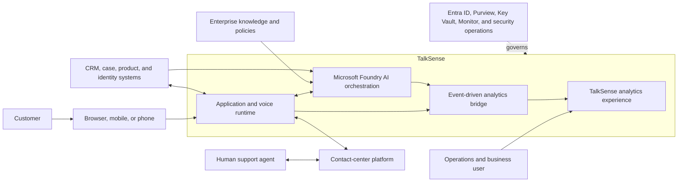
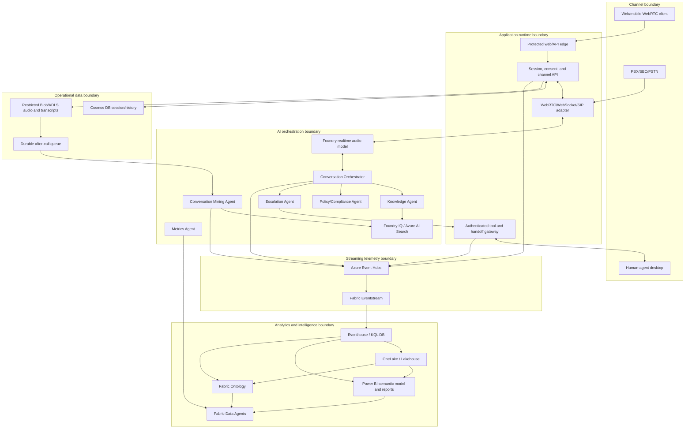

# ADR-006 — End-to-End Architecture: Microsoft Foundry + Event Hub + Fabric

- **Status:** Proposed
- **Date:** 2026-07-29

## Context

TalkSense currently starts at the telemetry producer and ends at Power BI. It has no customer channel, application runtime, voice transport, agent orchestration, knowledge retrieval, operational session store, recording store, mining pipeline, customer identity, CRM integration, or human-agent desktop integration.

The target solution has two different meanings of “realtime”:

- a sub-second, stateful **conversation path** that must continue speaking even when analytics is delayed;
- a seconds-to-minutes **operational analytics path** that tolerates at-least-once delivery, late events, and eventual OneLake materialization.

Coupling those paths would allow a Fabric, Event Hubs, mining, or reporting issue to interrupt a call. Isolating them without a shared event contract would make operational and business outcomes unobservable. The architecture therefore needs explicit boundaries and an asynchronous bridge.

## Decision

Adopt **Option C: an event-driven hybrid architecture using Microsoft Foundry, Azure Event Hubs, and Microsoft Fabric**.

- Microsoft Foundry and the application runtime own customer interaction, realtime audio, orchestration, tools, retrieval, and handoff.
- Cosmos DB owns operational conversation/session state.
- Blob Storage/ADLS Gen2 owns permitted recordings and transcript artifacts.
- Foundry IQ/Azure AI Search owns permission-aware retrieval over approved knowledge and redacted conversation chunks.
- Azure Event Hubs is the durable decoupling boundary for analytical events.
- Fabric Eventstream and Eventhouse own realtime analytical ingestion, KQL metrics, and operational dashboards.
- OneLake/Lakehouse, the Power BI semantic model, Fabric Ontology, and Fabric Data Agents own historical, semantic, and natural-language business intelligence.
- Azure Monitor, Application Insights, Log Analytics, Microsoft Purview, Entra ID, Key Vault, and policy controls span the architecture.

The customer response path never depends synchronously on Event Hubs, Eventstream, Eventhouse, OneLake, Power BI, ontology, or a Fabric Data Agent. Telemetry publication uses bounded buffering and cannot prevent a safe response or handoff.

### Context diagram

### Logical component diagram

### End-to-end flow

1. A customer enters through WebRTC or a SIP/contact-center channel.
2. The application establishes identity or an anonymous boundary, determines jurisdiction, captures consent, creates the session, and issues constrained realtime configuration.
3. Realtime audio interacts with the Conversation Orchestrator. The orchestrator calls only approved Knowledge, Policy/Compliance, and Escalation tools.
4. The application stores compact operational state in Cosmos DB and stores only permitted artifacts in restricted Blob/ADLS.
5. The session, agents, tools, and handoff gateway emit redacted, versioned analytical events to Event Hubs without blocking the call.
6. Eventstream ingests those events into Eventhouse. KQL dashboards and alerts serve current operations.
7. At call completion, a durable queue invokes the Conversation Mining pipeline. Redacted insights and knowledge chunks flow to Search, Event Hubs, and curated Lakehouse tables.
8. OneLake/Lakehouse and the semantic model provide historical reporting. Ontology connects the support domain, and scoped Data Agents answer governed questions.
9. Application Insights and Log Analytics retain protected operational traces; Purview provides data catalog, lineage, sensitivity, and governance.

## Options Considered

### Option A — Foundry-centric architecture

All channel, orchestration, state, tools, retrieval, and most analytics are implemented in the application/Foundry plane, with Application Insights and operational stores serving reporting.

**Advantages:** fastest path to a conversational prototype, fewer Fabric dependencies, and direct control of agent behavior.

**Disadvantages:** duplicates analytical logic, lacks the repository's Eventhouse/Power BI investment, weakens realtime business intelligence and ontology, and makes high-volume conversation analytics an application concern.

**Decision:** not selected alone. Foundry remains the conversation and AI plane.

### Option B — Fabric-centric analytics architecture

Fabric Eventstream, Eventhouse, OneLake, semantic models, ontology, and Data Agents become the center, with minimal application services.

**Advantages:** strong realtime analytics, governed historical data, business semantics, and natural-language BI.

**Disadvantages:** Fabric is not a bidirectional low-latency media runtime, customer authorization gateway, operational conversation database, or telephony controller. Data Agents are read-only analytical agents.

**Decision:** not selected alone. Fabric remains the analytics and business-intelligence plane.

### Option C — Event-driven hybrid Foundry + Event Hubs + Fabric

Foundry/application services own the call; Event Hubs asynchronously bridges approved events into Fabric.

**Advantages:** aligns each workload to its service, preserves call independence, reuses the repository, supports replay and multiple consumers, and gives business users realtime and historical intelligence.

**Disadvantages:** most components, identities, environments, contracts, cost centers, and failure modes. Requires disciplined correlation, privacy, deployment, and ownership.

**Decision:** selected.

## Consequences

### Positive

- A Fabric outage or delayed mining job does not terminate a live call.
- Customer-facing agents receive purpose-built operational state and knowledge rather than querying analytical stores directly.
- Event Hubs allows analytics, audit, and future consumers to evolve independently.
- Existing Bicep/Terraform, Fabric guidance, KQL, sample data, and Power BI assets remain useful.
- Data ownership and security boundaries are explicit.

### Negative

- TalkSense must operate Azure application services, Foundry, realtime audio, Cosmos DB, Storage, Search, Event Hubs, Monitor, and Fabric.
- Cross-service identity, private DNS, regional availability, quotas, release compatibility, and cost require a platform team.
- Eventual consistency means a live session, Eventhouse dashboard, OneLake table, and Power BI report can temporarily show different states.
- Disaster recovery cannot transparently migrate an active media session; reconnect, safe fallback, or handoff is required.

### Transitional

- The previous ADR-002 decision for Event Hubs → Eventstream → Eventhouse is incorporated and extended by ADR-004 and this ADR. Its historical text remains available in Git history.
- Existing SAS authorization and public networking are development defaults only. Production posture is defined by ADR-007.

## Security and Governance Considerations

- Use separate Azure subscriptions/resource groups, Foundry projects, Fabric workspaces, identities, stores, keys, and capacities for development, test, and production as required by the landing-zone model.
- Expose only the protected application edge. Browser media uses short-lived sessions; data stores, tools, Event Hubs, and AI services use managed identity and private connectivity where supported.
- Use a WAF/API gateway, rate limits, bot/abuse controls, tenant isolation, and authenticated server-side tool execution.
- Assign one managed identity per workload or trust boundary. Use Key Vault for secrets that cannot use Entra ID and PIM for privileged operators.
- Keep raw audio and unredacted transcripts in a restricted data zone. Event Hubs, Fabric, Search, and general traces receive redacted or pseudonymized data only.
- Apply Purview cataloging, lineage, sensitivity, DLP, ownership, and retention across Azure and Fabric data products.
- Document every boundary that cannot be private in the selected service tier/feature status. Compensate with Entra authentication, tenant/session isolation, restricted ingress/egress, monitoring, and no direct customer exposure.
- Use ADR-007 controls for consent, deletion, prompt injection, guardrails, tool approval, safety, and human handoff.

## Observability and Evaluation

Use W3C trace context and common `tenantId`, `conversationId`, `sessionId`, `correlationId`, `eventId`, and deployment-version fields across all boundaries.

Operational service objectives cover:

- channel/session availability and setup;
- time to first audio, response and tool latency, interruption, and handoff;
- Cosmos DB, Search, Storage, queue, model, and tool dependency health;
- Event Hubs backlog, Eventstream delivery, Eventhouse ingestion/query, and OneLake freshness;
- agent/model quality, grounding, policy adherence, PII leakage, and safety;
- mining completion, extraction quality, indexing freshness, and deletion;
- Data Agent query correctness, authorization, freshness, and latency.

Create end-to-end synthetic journeys for browser voice, text fallback, SIP call, knowledge answer, policy denial, transfer, after-call mining, Eventhouse metric, Power BI reconciliation, Data Agent question, and data deletion. Define separate SLOs for live interaction, operational analytics, and historical analytics.

## Implementation Notes

### Deployment

- Co-locate the application, realtime model deployment, Foundry project, Cosmos DB, Storage, Search, and Event Hubs where supported to control latency and residency. Verify that the Fabric capacity/workspace region satisfies the data-residency requirement.
- Deploy stateless API/tool services on an approved Azure compute platform such as App Service or Container Apps. Select based on WebSocket/media requirements, autoscaling, private networking, and organizational operations standards.
- Externalize recoverable state to Cosmos DB. Treat active realtime sessions as ephemeral and design reconnect/handoff rather than assuming transparent regional failover.
- Size Event Hubs partitions/throughput, Cosmos request units, Search capacity, model quota, app instances, Eventhouse cache/capacity, and Power BI/Fabric capacity from measured concurrency and payloads.
- Define RTO/RPO and paired-region behavior per service. Test DNS, identity, queue replay, data restoration, and degraded call handling.
- Extend the existing Bicep and Terraform incrementally. Automate Foundry and Fabric item promotion where supported and retain a documented manual control where an API/IaC path is unavailable.
- Run deployment jobs from a network location that can resolve and access private endpoints.

### Repository mapping

- Keep `infra/` as the infrastructure root and add modules rather than replacing the existing Event Hubs deployment.
- Keep the canonical event schemas and examples under `infra/docs/` or a future dedicated schema directory referenced from there.
- Preserve `powerbi/` for the semantic model and reports.
- Add application source directories only after the frontend/backend stack decision; no current repository language convention determines them.
- Add automated contract, infrastructure, application, agent-evaluation, and data-reconciliation tests alongside the components when implementation begins.

Primary references:

- [Customer Chatbot Solution Accelerator](https://github.com/microsoft/customer-chatbot-solution-accelerator)
- [Conversation Knowledge Mining Solution Accelerator](https://github.com/microsoft/Conversation-Knowledge-Mining-Solution-Accelerator)
- [Microsoft Foundry Agent Service](https://learn.microsoft.com/azure/ai-foundry/agents/overview)
- [Azure Event Hubs](https://learn.microsoft.com/azure/event-hubs/event-hubs-about)
- [Microsoft Fabric Real-Time Intelligence](https://learn.microsoft.com/fabric/real-time-intelligence/overview)
- [Azure Architecture Center: conversational data insights](https://learn.microsoft.com/azure/architecture/ai-ml/idea/unlock-insights-from-conversational-data)

## Open Questions

- Which customer identity, CRM, case-management, human-agent desktop, contact-center, carrier, and workforce systems are authoritative?
- Which Azure and Fabric regions satisfy realtime model, telephony, Content Understanding, ontology, data-residency, and private-network requirements together?
- Which application compute platform and implementation languages will be standardized?
- What live-call, operational-analytics, and historical-analytics SLOs, RTOs, and RPOs are required?
- What is the peak concurrency, call duration, event volume, recording volume, and growth forecast?
- Which services require zone or regional redundancy, and what degraded experience is acceptable?
- Who owns each runtime, data product, metric, ontology, prompt, policy, and incident?
- Which preview features are permitted in production, and what fallback exists for each?
- What budget and cost-allocation model applies to realtime audio, model tokens, search, storage, streaming, Fabric capacity, and observability?
