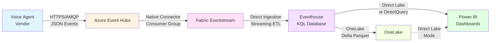
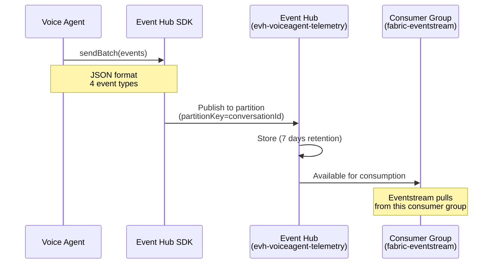
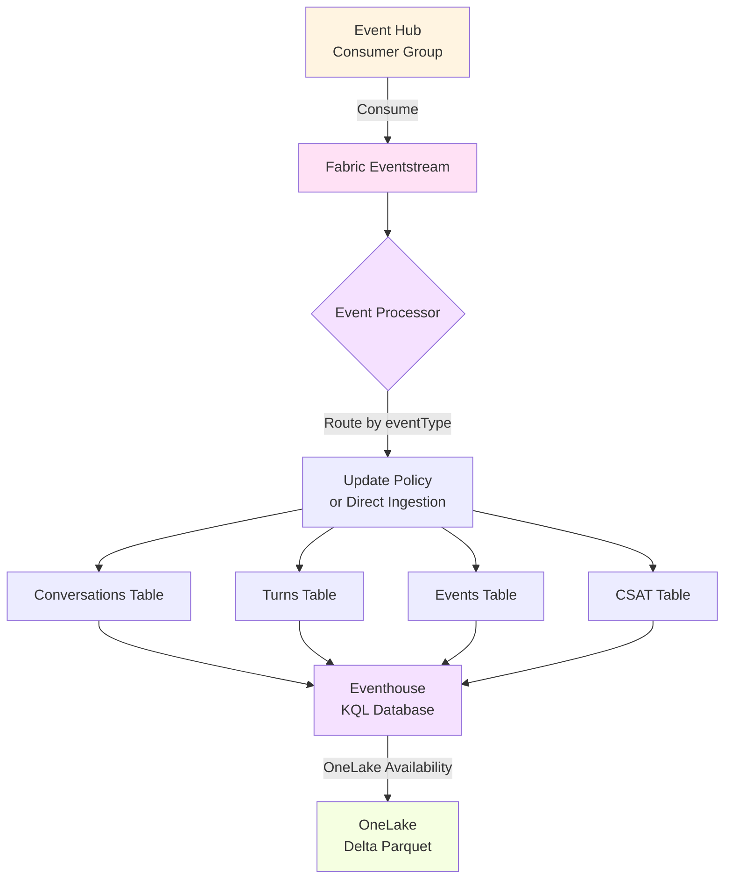
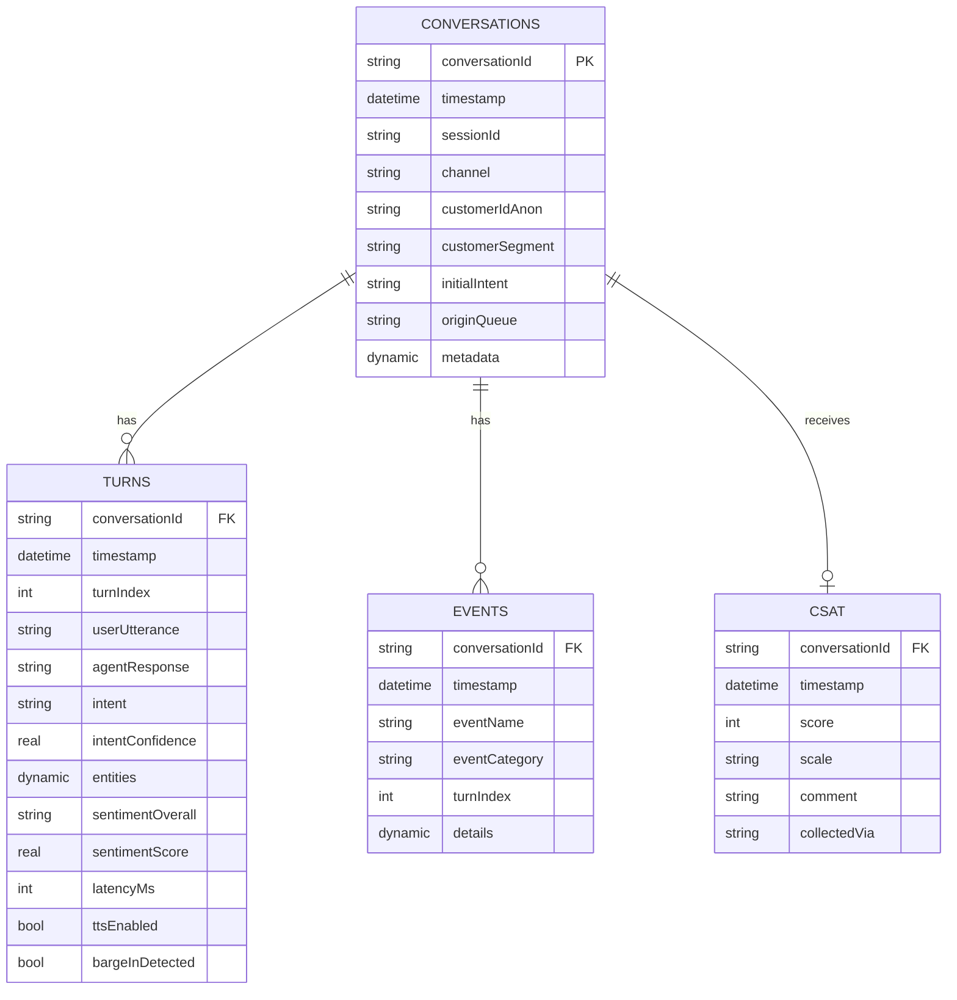
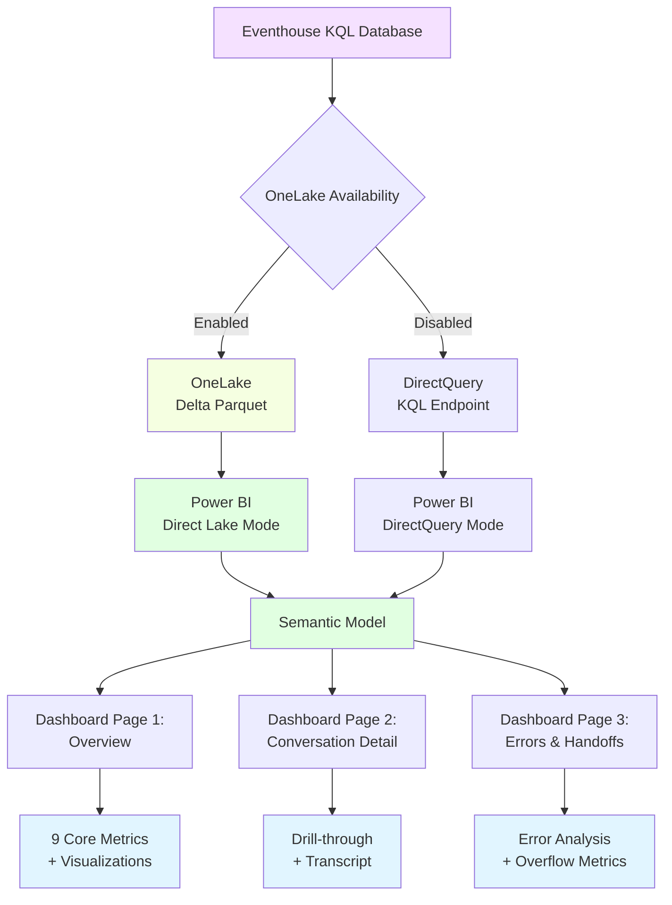
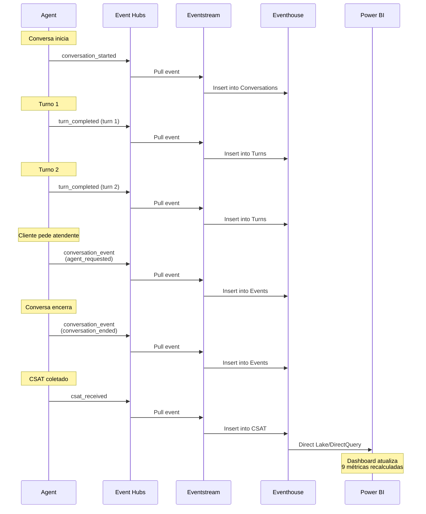
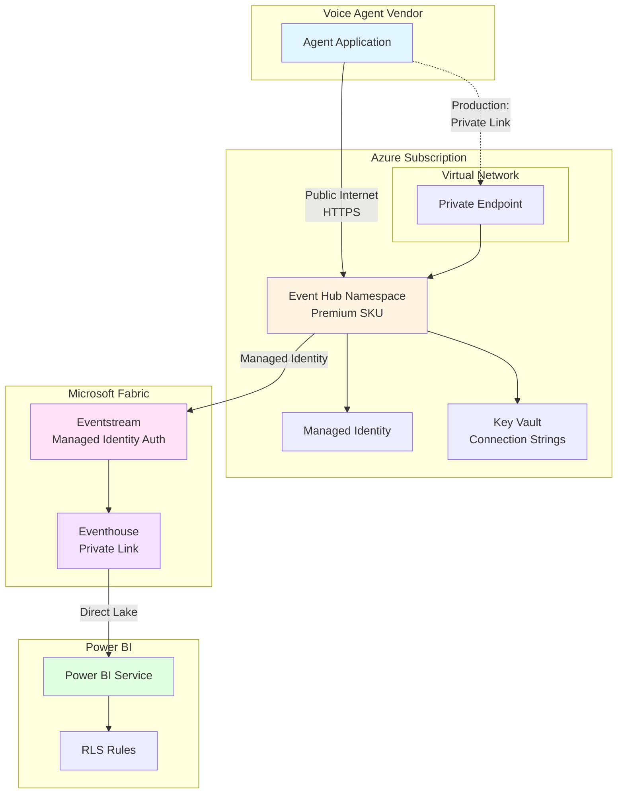
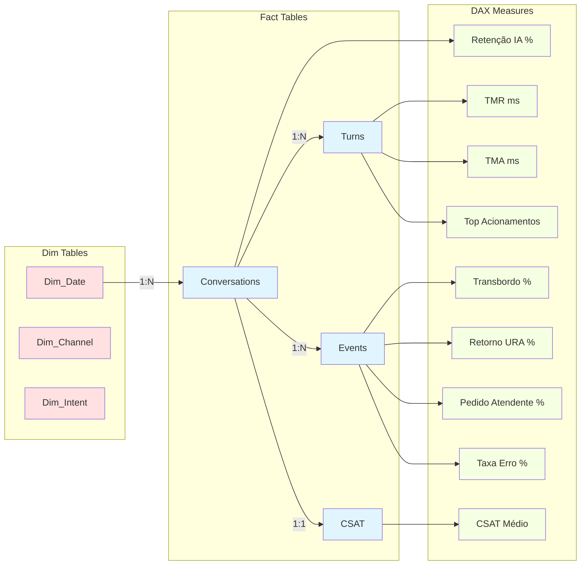

# Diagrama de Arquitetura Detalhado — Plan B

Este documento apresenta diagramas detalhados da arquitetura do Plano B para telemetria e analytics do agente de voz.

---

## Visão Geral da Arquitetura



---

## Fluxo de Dados Detalhado

### 1. Ingestão (Voice Agent → Event Hubs)



**Tipos de Eventos Enviados**:
1. `conversation_started` — Início do atendimento
2. `turn_completed` — Fim de cada turno (user ↔ agent)
3. `conversation_event` — Eventos especiais (erro, transbordo, etc.)
4. `csat_received` — Feedback do cliente

---

### 2. Processamento (Eventstream → Eventhouse)



**Opções de Ingestão**:

**A) Tabela RAW Única + Update Policies**:
```kql
RawTelemetry (all events) 
  → Update Policy → Conversations
  → Update Policy → Turns
  → Update Policy → Events
  → Update Policy → CSAT
```

**B) Direct Ingestion (Recomendado)**:
```
Eventstream routes directly to target tables based on eventType
```

---

### 3. Modelagem (Eventhouse Schema)



---

### 4. Analytics (Eventhouse → Power BI)



**Modos de Conexão**:

| Modo | Latência | Performance | Requer OneLake |
|------|----------|-------------|----------------|
| **Direct Lake** | ~5 min | ⚡⚡⚡ Excelente | ✅ Sim |
| **DirectQuery** | Segundos | ⚡⚡ Boa | ❌ Não |
| **Import** | Manual refresh | ⚡ Regular | ❌ Não (não recomendado) |

---

## Fluxo de Mensagem Completo (1 Conversa)



---

## Topologia de Rede (Produção)



**Segurança em Produção**:
- ✅ Private Endpoint para Event Hub
- ✅ Managed Identity (sem SAS keys)
- ✅ Private Link para Eventhouse (quando disponível)
- ✅ RLS no Power BI
- ✅ TLS 1.2+ obrigatório

---

## Estrutura de Dados — Power BI Semantic Model



**Relacionamentos**:
- `Dim_Date [Date] → Conversations [timestamp]` (1:N, cross-filter: both)
- `Conversations [conversationId] → Turns [conversationId]` (1:N, cross-filter: both)
- `Conversations [conversationId] → Events [conversationId]` (1:N, cross-filter: both)
- `Conversations [conversationId] → CSAT [conversationId]` (1:1, cross-filter: single)

---

## Comparação: Plan A vs Plan B

| Aspecto | Plan A (Cosmos DB) | Plan B (Fabric RTI) |
|---------|-------------------|-------------------|
| **Ingestion** | Event Hubs → Function → Cosmos | Event Hubs → Eventstream → Eventhouse |
| **Storage** | Cosmos DB (NoSQL) | Eventhouse (KQL) |
| **Analytics Layer** | Fabric Mirroring or Synapse Link | Native (KQL + OneLake) |
| **Power BI Mode** | Direct Lake via mirroring | Direct Lake native |
| **Peças Móveis** | 4 (EH + Function + Cosmos + Mirroring) | 2 (EH + Fabric) |
| **Time-to-Dashboard** | ~2 horas (replicação) | ~5 min (streaming) |
| **Latência Analytics** | ~2-3 horas | ~5 min - 30 min |
| **Best For** | OLTP + OLAP separados | Analytics near real-time |
| **Custo POC** | ~$200/mês | ~$300/mês |
| **Complexidade** | Maior | Menor |

**Recomendação**: Plan B para **POC e analytics near real-time**. Plan A se precisar de **store transacional separado** ou **multi-consumer** no Cosmos DB.

---

## Escalabilidade e Limites

### Event Hubs

| SKU | Throughput Units | Max Ingress | Max Egress | Retention |
|-----|------------------|-------------|------------|-----------|
| Basic | 1-20 TU | 1 MB/s/TU | 2 MB/s/TU | 1 dia |
| Standard | 1-20 TU | 1 MB/s/TU | 2 MB/s/TU | 7 dias |
| Premium | 1-16 PU | 8 MB/s/PU | 16 MB/s/PU | 90 dias |

**Exemplo**: 
- 1M eventos/dia × 1 KB/evento = 1 GB/dia ≈ 0.01 MB/s → **1 TU suficiente**
- 100M eventos/dia × 1 KB/evento = 100 GB/dia ≈ 1.2 MB/s → **2 TU necessário**

### Eventhouse

| Métrica | Limite | Notas |
|---------|--------|-------|
| Ingestion Rate | Depende do Fabric Capacity | F2: ~2 GB/h, F8: ~20 GB/h |
| Storage | Ilimitado | Custo adicional por TB |
| Query Performance | Sub-segundo para bilhões de eventos | Com particionamento adequado |
| Retention | Configurável (default: 365 dias) | Soft delete policy |

---

## Checklist de Design

### ✅ Considerações de Design Implementadas

- [x] **Particionamento** por `conversationId` (ordem preservada)
- [x] **Consumer Groups** dedicados (Fabric, Monitoring)
- [x] **Schema versionamento** via `eventType`
- [x] **LGPD compliance** (anonimização de IDs, mascaramento de PII)
- [x] **Retention policies** (Event Hub: 7d, Eventhouse: 365d)
- [x] **Idempotência** (conversationId único)
- [x] **Observabilidade** (métricas nativas do Azure)
- [x] **Segurança** (SAS para POC, Managed Identity para produção)

### ⏭️ Próximas Otimizações (Produção)

- [ ] Private Endpoints
- [ ] Multi-region replication (geo-redundancy)
- [ ] Auto-scaling (Event Hub auto-inflate)
- [ ] Alert rules (ingestion failures, latency spikes)
- [ ] Backup/DR strategy
- [ ] Cost optimization (capacity reservations, spot pricing)

---

## Referências

- [Event Hubs Quotas](https://learn.microsoft.com/azure/event-hubs/event-hubs-quotas)
- [Fabric Capacity Metrics](https://learn.microsoft.com/fabric/enterprise/licenses)
- [Eventhouse Best Practices](https://learn.microsoft.com/fabric/real-time-intelligence/best-practices)
- [Power BI Direct Lake Limits](https://learn.microsoft.com/power-bi/enterprise/directlake-overview#known-issues-and-limitations)

---

**Documento**: Diagrama de Arquitetura Detalhado — Plan B  
**Versão**: 1.0  
**Data**: 2026-07-02  
**Status**: ✅ Completo
